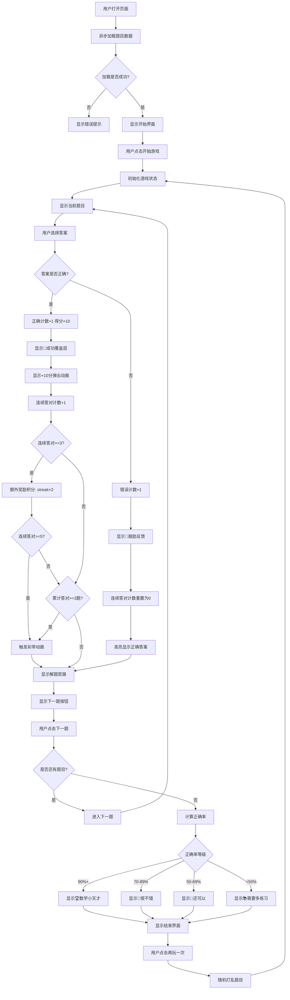
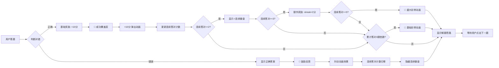
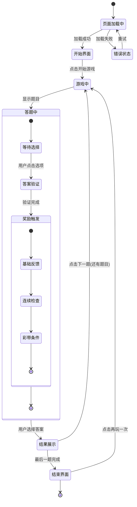
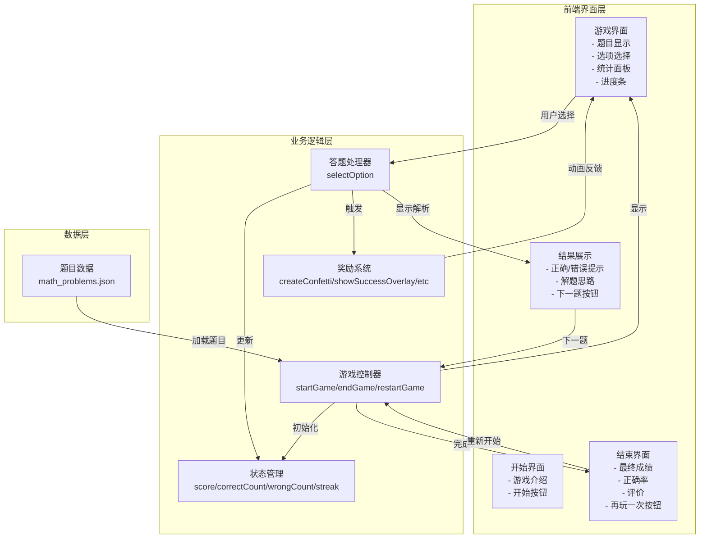
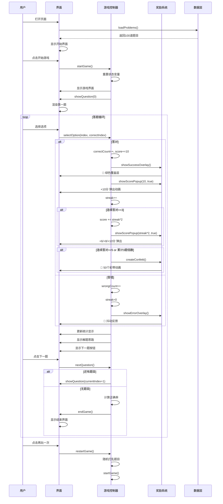

# 小学6年级比例数学游戏 - 详细设计文档

## 目录
1. [项目概述](#项目概述)
2. [架构设计](#架构设计)
3. [功能模块详解](#功能模块详解)
4. [函数级设计文档](#函数级设计文档)
5. [已完成功能列表](#已完成功能列表)
6. [技术实现细节](#技术实现细节)
7. [用户体验设计](#用户体验设计)

---

## 项目概述

### 项目简介
这是一个交互式的小学6年级比例数学学习游戏，包含100道精心设计的比例相关题目，通过游戏化的方式帮助学生学习和巩固比例知识。

### 核心特性
- 🎯 100道题目，涵盖10种比例题型
- 🎮 游戏化的答题体验
- 🏆 完整的积分和成就系统
- 🎨 丰富的视觉反馈和奖励动画
- 📝 每道题都有详细的解题思路
- 📊 实时统计和进度追踪
- 📱 响应式设计，支持移动设备

### 技术栈
- **前端**: 纯 HTML5 + CSS3 + JavaScript (ES6+)
- **数据格式**: JSON
- **服务器**: Python3 简易 HTTP 服务器（解决跨域问题）
- **兼容性**: 现代浏览器支持

---

## 架构设计

### 整体架构图

```
┌─────────────────────────────────────────────────────────────┐
│                        用户界面层                           │
├─────────────────────────────────────────────────────────────┤
│  ┌─────────────────┐  ┌─────────────────┐  ┌─────────────┐ │
│  │   开始界面      │  │   游戏界面      │  │   结束界面  │ │
│  └─────────────────┘  └─────────────────┘  └─────────────┘ │
└─────────────────────────────────────────────────────────────┘
                              ↓
┌─────────────────────────────────────────────────────────────┐
│                      业务逻辑层                             │
├─────────────────────────────────────────────────────────────┤
│  ┌─────────────┐  ┌─────────────┐  ┌─────────────────┐    │
│  │ 游戏流程控制 │  │ 奖励系统    │  │   状态管理     │    │
│  └─────────────┘  └─────────────┘  └─────────────────┘    │
└─────────────────────────────────────────────────────────────┘
                              ↓
┌─────────────────────────────────────────────────────────────┐
│                       数据层                                 │
├─────────────────────────────────────────────────────────────┤
│  ┌──────────────────────────────────────────────────────┐  │
│  │           math_problems.json (100道题目)             │  │
│  └──────────────────────────────────────────────────────┘  │
└─────────────────────────────────────────────────────────────┘
```

### 文件结构

```
math_game/
├── index.html                  # 主页面（包含HTML、CSS、JS）
├── math_problems.json          # 题目数据文件
├── server.py                   # Python HTTP服务器
├── generate_problems.py        # 题目生成脚本
├── start.sh                    # Unix/Linux/macOS启动脚本
├── start.bat                   # Windows启动脚本
├── README.md                   # 项目说明
├── 详细设计文档.md             # 本文档
└── venv/                       # Python虚拟环境（可选）
```

### 核心数据结构

#### 题目数据结构 (math_problems.json)
```json
{
  "problems": [
    {
      "type": "题型标识符",
      "type_name": "题型中文名称",
      "question": "题目文本",
      "options": ["选项A", "选项B", "选项C", "选项D"],
      "correct_index": 2,  // 正确答案索引（0-based）
      "explanation": "详细解题思路"
    }
  ]
}
```

---

## 产品逻辑流程图

### 整体游戏流程图



### 奖励系统逻辑图



### 状态流转图



### 用户交互流程图



### 详细时序图



---

## 功能模块详解

### 1. 游戏流程管理模块

#### 功能描述
管理整个游戏的生命周期，包括开始游戏、答题、下一题、结束游戏等流程。

#### 状态变量
```javascript
let problems = [];           // 题目数组
let currentIndex = 0;        // 当前题目索引
let correctCount = 0;        // 答对题数
let wrongCount = 0;          // 答错题数
let score = 0;               // 当前得分
let answered = false;        // 当前题是否已回答
let streak = 0;              // 连续答对计数
```

---

### 2. 奖励系统模块（核心新增功能）

#### 功能描述
为用户提供即时、丰富的正面反馈，增强学习的趣味性和成就感。

#### 奖励层级
| 触发条件 | 奖励内容 | 视觉效果 |
|---------|---------|---------|
| 答对任意1题 | 成功覆盖层 + 得分弹出 | 🎉 绿色闪烁 |
| 累计答对3题 | 彩带动画 | 🎊 50个彩色粒子 |
| 连续答对2题 | 显示连续徽章 | 🔥 徽章出现 |
| 连续答对3题+ | 额外奖励积分 | +6, +8, +10... |
| 连续答对5题+ | 盛大彩带动画 | 🎊 增强效果 |
| 答错1题 | 鼓励反馈 | 💪 抖动效果 |

---

### 3. 数据加载模块

#### 功能描述
从外部JSON文件异步加载题目数据，处理加载失败的情况。

---

### 4. 界面更新模块

#### 功能描述
负责所有UI元素的更新，包括统计显示、进度条、徽章状态等。

---

## 函数级设计文档

### 1. 数据加载函数

#### `loadProblems()`
```javascript
/**
 * 异步加载题目数据
 * 
 * 功能：
 * - 从math_problems.json获取题目数据
 * - 更新题目总数显示
 * - 处理加载失败情况
 * 
 * 调用时机：页面初始化时
 * 
 * 返回值：Promise<void>
 */
async function loadProblems()
```

**实现细节：**
- 使用 `fetch()` API 进行异步请求
- 使用 `try-catch` 捕获网络错误
- 加载失败时通过 `alert()` 提示用户
- 成功后更新 `totalNumber` DOM元素

---

### 2. 游戏控制函数

#### `startGame()`
```javascript
/**
 * 开始新游戏
 * 
 * 功能：
 * - 隐藏开始界面，显示游戏界面
 * - 重置所有游戏状态变量
 * - 初始化统计和徽章显示
 * - 显示第一题
 * 
 * 调用时机：用户点击"开始游戏"按钮时
 */
function startGame()
```

**实现细节：**
- 通过 `classList.add/remove('hidden')` 切换界面
- 重置所有状态变量为初始值
- 调用 `updateStats()` 和 `updateStreakBadge()` 初始化显示
- 调用 `showQuestion()` 显示第一题

---

#### `endGame()`
```javascript
/**
 * 结束游戏，显示结果界面
 * 
 * 功能：
 * - 隐藏游戏界面，显示结束界面
 * - 计算正确率
 * - 根据得分显示不同的评价和图标
 * 
 * 调用时机：完成最后一题后
 */
function endGame()
```

**实现细节：**
- 计算正确率：`(correctCount / problems.length) * 100`
- 根据正确率分4个等级：
  - 90%+：🏆 数学小天才
  - 70-89%：🌟 很不错
  - 50-69%：💪 还可以
  - <50%：📚 需要多练习

---

#### `restartGame()`
```javascript
/**
 * 重新开始游戏
 * 
 * 功能：
 * - 随机打乱题目顺序
 * - 调用startGame()重新开始
 * 
 * 调用时机：用户点击"再玩一次"按钮时
 */
function restartGame()
```

**实现细节：**
- 使用 `sort(() => Math.random() - 0.5)` 打乱数组
- Fisher-Yates 洗牌算法的简化版本

---

### 3. 题目显示函数

#### `showQuestion()`
```javascript
/**
 * 显示当前题目
 * 
 * 功能：
 * - 检查是否已完成所有题目
 * - 更新题目号、题型、题目文本
 * - 更新进度条
 * - 生成选项按钮
 * - 隐藏解析和下一题按钮
 * 
 * 调用时机：开始游戏、进入下一题时
 */
function showQuestion()
```

**实现细节：**
- 进度条宽度：`(currentIndex / problems.length) * 100%`
- 选项通过 `document.createElement('div')` 动态生成
- 每个选项绑定 `onclick` 事件处理器
- 保存 `correctIndex` 供答题检查使用

---

### 4. 答题处理函数（核心函数）

#### `selectOption(selectedIndex, correctIndex)`
```javascript
/**
 * 处理用户答题选择
 * 
 * 功能：
 * - 检查是否已回答（防止重复答题）
 * - 禁用所有选项
 * - 高亮显示正确/错误选项
 * - 更新得分和统计
 * - 触发相应的奖励动画
 * - 显示解题思路
 * - 显示下一题按钮
 * 
 * 参数：
 * - selectedIndex: 用户选择的选项索引
 * - correctIndex: 正确答案的索引
 * 
 * 调用时机：用户点击选项时
 */
function selectOption(selectedIndex, correctIndex)
```

**实现细节（奖励系统集成）：**
```
用户答题
    ↓
判断对错
    ↓
┌─────────────┬─────────────┐
│   答对      │   答错      │
└─────────────┴─────────────┘
      ↓              ↓
┌─────────────┐ ┌─────────────┐
│ +10分       │ 显示正确答案 │
│ 正确计数+1  │ 错误计数+1   │
│ 🎉 成功层   │ 💪 错误层    │
│ +10分弹出   │             │
│ (每3题)彩带 │             │
└─────────────┘ └─────────────┘
      ↓              ↓
      └──────┬───────┘
             ↓
      更新连续答对计数
             ↓
      显示解题思路
             ↓
      显示下一题按钮
```

**代码流程：**
1. 检查 `answered` 标志，防止重复答题
2. 设置 `answered = true`
3. 给所有选项添加 `.disabled` 类
4. 判断是否正确：
   - 正确：
     - 添加 `.correct` 类到选中项
     - `correctCount++`
     - `score += 10`
     - 调用 `showSuccessOverlay()`
     - 调用 `showScorePopup(10, true)`
     - 每答对3题调用 `createConfetti()`
   - 错误：
     - 添加 `.wrong` 类到选中项
     - 添加 `.correct` 类到正确项
     - `wrongCount++`
     - 调用 `showErrorOverlay()`
5. 调用 `updateStreak(isCorrect)`
6. 调用 `updateStats()`
7. 显示解析
8. 显示下一题按钮

---

### 5. 奖励系统函数（核心新增函数）

#### `createConfetti()`
```javascript
/**
 * 创建彩带动画效果
 * 
 * 功能：
 * - 生成50个彩色粒子
 * - 随机位置、颜色、形状、大小
 * - 应用飘落动画
 * - 自动清理DOM元素
 * 
 * 动画参数：
 * - 粒子数量：50个
 * - 颜色：8种随机颜色
 * - 形状：■ ● ▲ ★ ♦
 * - 字体大小：10-30px
 * - 动画时长：2-4秒
 * - 延迟：0-2秒随机
 * - 清理时间：5秒后
 * 
 * 调用时机：每答对3题、连续答对5题+
 */
function createConfetti()
```

**实现细节：**
- 使用 `document.createElement('div')` 创建每个粒子
- CSS类：`.confetti`
- 动画：`confetti-fall`（从顶部飘落到底部）
- 随机化：
  - `left`: Math.random() * 100 + 'vw'
  - `color`: 从预定义数组随机选择
  - `fontSize`: Math.random() * 20 + 10 + 'px'
  - `animationDelay`: Math.random() * 2 + 's'
  - `animationDuration`: Math.random() * 2 + 2 + 's'
- 自动清理：setTimeout 5秒后移除元素

**CSS动画：**
```css
@keyframes confetti-fall {
    0% { transform: translateY(-100vh) rotate(0deg); opacity: 1; }
    100% { transform: translateY(100vh) rotate(720deg); opacity: 0; }
}
```

---

#### `showSuccessOverlay()`
```javascript
/**
 * 显示成功覆盖层
 * 
 * 功能：
 * - 全屏绿色半透明覆盖
 * - 显示🎉庆祝图标
 * - 脉冲动画效果
 * - 0.8秒后自动隐藏
 * 
 * 调用时机：答对任意题目时
 */
function showSuccessOverlay()
```

**实现细节：**
- 覆盖层类：`.success-overlay`
- 动画：`pulse-success`（从深到浅的绿色）
- 内容：`<div class="celebration-text">🎉</div>`
- 隐藏：setTimeout 800ms 后添加 `.hidden`

**CSS动画：**
```css
@keyframes pulse-success {
    0% { background: rgba(34, 197, 94, 0.5); }
    100% { background: rgba(34, 197, 94, 0.2); }
}
```

---

#### `showErrorOverlay()`
```javascript
/**
 * 显示错误覆盖层
 * 
 * 功能：
 * - 全屏红色半透明覆盖
 * - 显示💪鼓励图标
 * - 抖动动画效果
 * - 0.5秒后自动隐藏
 * 
 * 调用时机：答错题目时
 */
function showErrorOverlay()
```

**实现细节：**
- 覆盖层类：`.error-overlay`
- 动画：`shake`（左右抖动）
- 内容：`<div class="encouragement-text">💪</div>`
- 隐藏：setTimeout 500ms 后添加 `.hidden`

**CSS动画：**
```css
@keyframes shake {
    0%, 100% { transform: translateX(0); }
    25% { transform: translateX(-10px); }
    75% { transform: translateX(10px); }
}
```

---

#### `showScorePopup(points, isCorrect)`
```javascript
/**
 * 显示得分弹出动画
 * 
 * 功能：
 * - 在屏幕随机位置显示得分
 * - 向上飞出的动画效果
 * - 1.5秒后自动消失
 * 
 * 参数：
 * - points: 分数值（如10）
 * - isCorrect: 是否为正确答案的加分
 * 
 * 调用时机：答对题、连续答对奖励时
 */
function showScorePopup(points, isCorrect)
```

**实现细节：**
- 文本：`isCorrect ? '+' + points + '分' : '继续加油'`
- 颜色：`isCorrect ? '#22c55e' : '#f59e0b'`
- 位置：left随机在30-70vw，top=40vh
- 动画：`score-fly`（向上飞出）
- 清理：setTimeout 1500ms后移除

**CSS动画：**
```css
@keyframes score-fly {
    0% { transform: translateY(0) scale(1); opacity: 1; }
    100% { transform: translateY(-150px) scale(1.5); opacity: 0; }
}
```

---

#### `updateStreak(isCorrect)`
```javascript
/**
 * 更新连续答对计数
 * 
 * 功能：
 * - 答对时增加streak
 * - 答错时重置streak为0
 * - 连续3题+给予额外奖励
 * - 连续5题+触发彩带
 * 
 * 参数：
 * - isCorrect: 当前题是否答对
 * 
 * 调用时机：用户答题后
 */
function updateStreak(isCorrect)
```

**实现细节：**
```
if isCorrect:
    streak++
else:
    streak = 0

更新徽章显示

if streak >= 3 and isCorrect:
    bonusPoints = streak * 2
    score += bonusPoints
    显示 +bonusPoints 弹出
    
    if streak >= 5:
        触发彩带
```

**奖励计算：**
| streak | 额外奖励 |
|--------|---------|
| 3 | +6分 |
| 4 | +8分 |
| 5 | +10分 + 彩带 |
| 6 | +12分 + 彩带 |
| ... | ... |

---

#### `updateStreakBadge()`
```javascript
/**
 * 更新连续答对徽章显示
 * 
 * 功能：
 * - streak >= 2时显示徽章
 * - 更新徽章中的数字
 * - streak < 2时隐藏徽章
 * 
 * 调用时机：startGame()、updateStreak() 后
 */
function updateStreakBadge()
```

**实现细节：**
- 显示条件：`streak >= 2`
- 徽章类：`.streak-badge`
- 徽章位置：右上角 `position: fixed; top: 20px; right: 20px;`
- 动画：`badge-appear`（从右侧滑入）

**CSS动画：**
```css
@keyframes badge-appear {
    0% { transform: translateX(100px) scale(0); }
    100% { transform: translateX(0) scale(1); }
}
```

---

### 6. 界面更新函数

#### `updateStats()`
```javascript
/**
 * 更新统计显示
 * 
 * 功能：
 * - 更新正确题数
 * - 更新错误题数
 * - 更新当前得分
 * 
 * 调用时机：答题后、开始游戏时
 */
function updateStats()
```

**实现细节：**
- 更新三个DOM元素：
  - `correctCount`: `correctCount`
  - `wrongCount`: `wrongCount`
  - `scoreDisplay`: `score`

---

#### `nextQuestion()`
```javascript
/**
 * 进入下一题
 * 
 * 功能：
 * - currentIndex递增
 * - 检查是否已完成所有题目
 * - 调用showQuestion()或endGame()
 * 
 * 调用时机：用户点击"下一题"按钮时
 */
function nextQuestion()
```

---

## 已完成功能列表

### ✅ 基础功能

1. **题目加载**
   - [x] 异步加载100道题目
   - [x] 错误处理和用户提示
   - [x] 题目总数显示

2. **游戏流程**
   - [x] 开始游戏界面
   - [x] 游戏界面显示
   - [x] 题目逐题展示
   - [x] 结束游戏界面
   - [x] 重新开始功能
   - [x] 题目随机打乱

3. **答题功能**
   - [x] 四选项选择
   - [x] 答案验证
   - [x] 正确/错误视觉反馈
   - [x] 防止重复答题
   - [x] 显示正确答案
   - [x] 显示解题思路

4. **统计系统**
   - [x] 正确题数计数
   - [x] 错误题数计数
   - [x] 得分统计
   - [x] 正确率计算
   - [x] 进度条显示
   - [x] 题目号显示

### ✅ 奖励系统（核心新增）

5. **基础奖励**
   - [x] 成功覆盖层动画 🎉
   - [x] 得分弹出动画 +10
   - [x] 错误鼓励反馈 💪

6. **彩带动画**
   - [x] 50个彩色粒子
   - [x] 随机位置、颜色、形状
   - [x] 飘落动画效果
   - [x] 自动DOM清理
   - [x] 每答对3题触发
   - [x] 连续答对5题+触发

7. **连续答对系统**
   - [x] 连续答对计数
   - [x] 连续答对徽章显示（2题+）
   - [x] 连续答对徽章动画
   - [x] 额外奖励积分（3题+）
   - [x] 积分递进机制（每+1题+2分）
   - [x] 连续5题+彩带

8. **结果评价**
   - [x] 四档评价系统
   - [x] 对应图标显示
   - [x] 鼓励性文案

### ✅ 用户体验

9. **视觉设计**
   - [x] 现代化渐变背景
   - [x] 卡片式布局
   - [x] 悬停效果
   - [x] 点击反馈
   - [x] 平滑过渡动画
   - [x] 配色方案优化

10. **响应式设计**
    - [x] 移动端适配
    - [x] 小屏幕字体调整
    - [x] 布局自适应

11. **动画系统**
    - [x] 彩带动画
    - [x] 脉冲动画
    - [x] 抖动动画
    - [x] 弹入动画
    - [x] 飞出动画
    - [x] 徽章出现动画

### ✅ 技术基础设施

12. **服务器**
    - [x] Python HTTP服务器
    - [x] CORS跨域支持
    - [x] 自动打开浏览器
    - [x] 错误处理

13. **启动脚本**
    - [x] Unix/Linux/macOS (start.sh)
    - [x] Windows (start.bat)

---

## 技术实现细节

### CSS动画详解

#### 1. 彩带动画
```css
.confetti {
    position: fixed;
    pointer-events: none;
    z-index: 1000;
    animation: confetti-fall 3s ease-out forwards;
}

@keyframes confetti-fall {
    0% {
        transform: translateY(-100vh) rotate(0deg);
        opacity: 1;
    }
    100% {
        transform: translateY(100vh) rotate(720deg);
        opacity: 0;
    }
}
```
**关键点：**
- `forwards`：动画结束后保持最终状态
- `rotate(720deg)`：旋转两周
- `ease-out`：先快后慢的时间曲线

#### 2. 成功脉冲动画
```css
@keyframes pulse-success {
    0% { background: rgba(34, 197, 94, 0.5); }
    100% { background: rgba(34, 197, 94, 0.2); }
}
```
**关键点：**
- RGBA颜色的alpha通道变化
- 从深到浅的渐变过渡

#### 3. 错误抖动动画
```css
@keyframes shake {
    0%, 100% { transform: translateX(0); }
    25% { transform: translateX(-10px); }
    75% { transform: translateX(10px); }
}
```
**关键点：**
- 经典的左右抖动效果
- 4个关键帧实现

#### 4. 庆祝弹入动画
```css
@keyframes bounce-in {
    0% { transform: scale(0); opacity: 0; }
    50% { transform: scale(1.3); }
    100% { transform: scale(1); opacity: 1; }
}
```
**关键点：**
- 从无到有
- 超过目标后回弹

#### 5. 得分飞出动画
```css
@keyframes score-fly {
    0% { transform: translateY(0) scale(1); opacity: 1; }
    100% { transform: translateY(-150px) scale(1.5); opacity: 0; }
}
```
**关键点：**
- 向上移动的同时放大
- 逐渐消失

#### 6. 徽章出现动画
```css
@keyframes badge-appear {
    0% { transform: translateX(100px) scale(0); }
    100% { transform: translateX(0) scale(1); }
}
```
**关键点：**
- 从右侧滑入
- 同时从无到有

---

### DOM操作优化

#### 1. 事件委托
虽然当前代码直接绑定事件，但也可以使用事件委托优化：
```javascript
document.getElementById('options').addEventListener('click', (e) => {
    if (e.target.classList.contains('option')) {
        const index = parseInt(e.target.dataset.index);
        selectOption(index, correctIndex);
    }
});
```

#### 2. DOM清理
所有动态创建的元素都有对应的清理机制：
- 彩带：5秒后自动移除
- 得分弹出：1.5秒后自动移除
- 覆盖层：0.5-0.8秒后自动隐藏

---

### 性能考虑

#### 1. 动画性能
- 使用 `transform` 和 `opacity` 触发GPU加速
- 避免修改 `top`/`left` 等触发布局重排的属性
- 合理的 `z-index` 层级管理

#### 2. 内存管理
- 及时清理不再需要的DOM元素
- 避免内存泄漏
- 限制同时存在的动画元素数量

---

## 用户体验设计

### 奖励系统设计理念

#### 1. 即时反馈
- **原则**: 用户答题后立即给出反馈
- **实现**: 0延迟显示覆盖层和弹出动画

#### 2. 正强化
- **原则**: 答对给奖励，答错给鼓励
- **实现**: 
  - 答对：🎉 +10分 + 彩带
  - 答错：💪 + 显示正确答案

#### 3. 渐进式奖励
- **原则**: 奖励随着成就增加而增强
- **实现**:
  - 1题：基础奖励
  - 3题：彩带动画
  - 5题：更多彩带 + 更高额外分

#### 4. 成就感
- **原则**: 用户能直观感受到自己的进步
- **实现**:
  - 实时得分显示
  - 连续答对徽章
  - 最终评价系统

### 视觉设计原则

#### 1. 配色方案
- **主色**: 蓝紫色渐变 (#667eea → #764ba2)
- **成功**: 绿色 (#22c55e)
- **错误**: 红色 (#ef4444)
- **警告/鼓励**: 橙色 (#f59e0b)
- **中性**: 灰色 (#64748b)

#### 2. 字体层次
- 标题: 28px, 粗体
- 题目: 18px
- 选项: 16px
- 统计: 28px（数字）, 12px（标签）
- 移动端相应缩小

#### 3. 间距系统
- 大间距: 30px
- 中间距: 20px
- 小间距: 10-12px

---

## 总结

### 核心改进
本次修复的核心是**激活了完整的奖励系统**，让用户在答题过程中获得即时、丰富、有趣的正面反馈，大大提升了学习的趣味性和成就感。

### 技术亮点
1. ✅ 7种精心设计的CSS动画
2. ✅ 完整的奖励层级系统
3. ✅ 连续答对成就机制
4. ✅ 自动DOM清理防止内存泄漏
5. ✅ 响应式设计支持移动设备
6. ✅ 流畅的用户体验

### 未来可扩展方向
- 添加音效
- 成就系统持久化（localStorage）
- 更多题目类型
- 难度分级
- 多人对战模式
- 学习进度分析

---

**文档版本**: v1.0
**最后更新**: 2024年
**状态**: ✅ 完成并验证

---

## 版权信息

Copyright © 2024 yoyo. All rights reserved.

## MIT License

Permission is hereby granted, free of charge, to any person obtaining a copy
of this software and associated documentation files (the "Software"), to deal
in the Software without restriction, including without limitation the rights
to use, copy, modify, merge, publish, distribute, sublicense, and/or sell
copies of the Software, and to permit persons to whom the Software is
furnished to do so, subject to the following conditions:

The above copyright notice and this permission notice shall be included in all
copies or substantial portions of the Software.

THE SOFTWARE IS PROVIDED "AS IS", WITHOUT WARRANTY OF ANY KIND, EXPRESS OR
IMPLIED, INCLUDING BUT NOT LIMITED TO THE WARRANTIES OF MERCHANTABILITY,
FITNESS FOR A PARTICULAR PURPOSE AND NONINFRINGEMENT. IN NO EVENT SHALL THE
AUTHORS OR COPYRIGHT HOLDERS BE LIABLE FOR ANY CLAIM, DAMAGES OR OTHER
LIABILITY, WHETHER IN AN ACTION OF CONTRACT, TORT OR OTHERWISE, ARISING FROM,
OUT OF OR IN CONNECTION WITH THE SOFTWARE OR THE USE OR OTHER DEALINGS IN THE
SOFTWARE.
